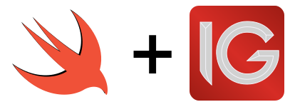

    

  

This framework provides:
- Interface to IG's **HTTP APIs and Lightstreamer service**.
- Session management helpers.
- **ReactiveSwift support** for easy endpoint pipelining.

Usage
-----

### Session

### HTTP API

### Lightstreamer

Installation
------------

This framework has the following dependencies:
- [Result](https://github.com/antitypical/Result).
- [ReactiveSwift](https://github.com/ReactiveCocoa/ReactiveSwift).
- [Lightstreamer](https://lightstreamer.com/download/).
  IG has only support an older version from the Lightstreamer framework. Check the  [labs.ig.com](https://labs.ig.com/lightstreamer-downloads) for information on the latest Lightstreamer version supported.

To hold this framework binaries you have two options.
- Grab the `.framework` file for the platform of your choice from [the Github releases page](https://github.com/dehesa/IG/releases).
    - Download the framework file to your computer.
    - Drag-and-drop it within your project.
    - If you are using Xcode, drag-and-drop the framework in `Linked Frameworks & Libraries` and don't forget to add the dependencies there either.
- Clone and build with Xcode.
    - Clone the git project: `git clone --recursive git@github.com:dehesa/IG.git`
    - Open the `IG.xcworkspace` with Xcode.
    - Select the build scheme for your targeted platform (e.g. `IG [macOS]`).
    - Product > Build (or keyboard shortcut `⌘+B`).
    - Open the project's `Products` folder and drag-and-drop the built framework in your project (or right-click in it and `Show in Finder`).

Roadmap
-------
