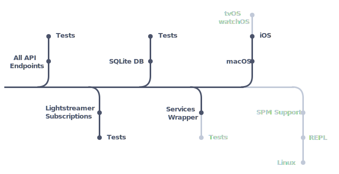

<p align="center">
    
</p>

<p align="center">
    <a href="https://swift.org/about/#swiftorg-and-open-source"></a>
    <a href="https://github.com/dehesa/CodableCSV/wiki/Implicit-dependencies"></a>
    <a href="https://developer.apple.com/xcode"></a>
    <a href="http://doge.mit-license.org"></a>
</p>

This framework provides:

-   Access to IG's HTTP APIs.
-   Access to IG's Lightstreamer service.
    <br>The Lighstreamer binaries are packaged with the source code. IG only supports an older Lightstreamer version and this framework provides exactly that version. To know more, check [labs.ig.com](https://labs.ig.com/lightstreamer-downloads).
-   Session management helpers.
    <br>Such as OAuth and certificate token refreshes, etc.
-   Endpoints & Lighstreamer events cache.
    <br>Implement through SQLite.

# Usage

The IG framework can be used to interface with IG's APIs, Lightstreamer's "real-time" events, and cache temporary data.

-   Access all IG's endpoints through the `API` instance.
    <br>All endpoints listed in IG's [API reference](https://labs.ig.com/rest-trading-api-reference) are supported (browse `API.swift` file to check them out).
    <br>These endpoints offer compile-time interfaces for Swift and use Standard or Foundation types (e.g. `Date`).

    ```swift
    let api = API(credentials: nil, targetQueue: nil)
    api.login(type: .certificate, key: "a12345bc67890d12345e6789fg0hi123j4567890", user: .init("username", "password")).expectsCompletion()

    let yesterday = Calendar.current.date(byAdding: .day, value: -1, to: Date())!
    api.price.get(epic: "CS.D.EURUSD.MINI.IP", from: yesterday, resolution: .minute).sink { (prices, allowance) in
        print(prices)
    }
    ```

-   Establish "real-time" connections through the `Streamer` instance.
    <br>All subscriptions listed in IG's [Streaming API reference](https://labs.ig.com/streaming-api-reference) are supported (browse `Streamer.swift` file to check them out).
    <br>As with the HTTP service, this framework offer compile-time interfaces for Swift and use Standard and/or Foundation types.

    ```swift
    let streamer = Streamer(rootURL: "...", credentials: .init(identifier: "ABC12", password: "..."), targetQueue: nil)
    streamer.session.connect().expectsCompletion()
    streamer.price.subscribe(epic: "CS.D.EURUSD.MINI.IP", interval: .second, fields: [.date, . volume, .openBid, .closeBid]).sink {
      print($0)
    }
    ```

    > Please be mindful of the [limits enforced by IG](https://labs.ig.com/faq#limits).

-   Create an in-memory or file database with the `DB` instance.
    <br>The database is _work in progress_; currently only supporting price resolutions of one minute.

Although you can cherry pick which service to use, it might be simpler to let the convenience `Services` initialize all subservices for you. To log in you need:

-   an _API key_.
    <br>You can get one from someone that has an IG application, or you can [generate your own](https://labs.ig.com/gettingstarted); e.g. `a12345bc67890d12345e6789fg0hi123j4567890`.
-   Information for the user you will be logged in as.
    <br>You can log in with your actual credentials.
    ```swift
    let user: API.User = .init(name: "username", password: "password")
    let apiKey: API.Key = "a12345bc67890d12345e6789fg0hi123j4567890"
    var services = Services.make(key: apiKey, user: user).sink(...)
    ```
    Optionally you can log in with an OAuth token or Certificate token.
    ```swift
    let oauthAccess = "toa7770m-1915-83u4-q665-80g574lm7659"
    let oauthRefresh = "rho2072f-4006-17t8-n417-42j560hw5130"
    let apiKey = "a12345bc67890d12345e6789fg0hi123j4567890"
    let token: API.Credentials.Token = .init(.oauth(access: oauthAccess, refresh: oauthRefresh, scope: "profile", type: "Bearer"), .expiresIn: 60))
    var services = Services.make(key: apiKey, token: token).sink(...)
    ```

A `Services` instance has completely functional HTTP, Lightstreamer services, and SQLite database. All these services are initialized and ready to operate.

```swift
services.api.transactions.get(from: .yesterday: to: Date()).sink { (transactions) in
    print("Between yesterday and today, there were \(transactions.count) transactions")

    for transaction in transactions {
        print(transaction.profitLoss)
    }
}

services.streamer.markets.subscribe(to: "CS.D.EURUSD.MINI.IP", fields: [.bid, .offer, .date]).startWithValues {
    print("Date: \($0.date!)")
    print("Offer: \($0.price.offer!)")
    print("Bid: \($0.price.bid!)")
}
```

## Dependencies

The following is a list of 1st party and 3rd party library/framework dependencies:

-   Foundation.
-   SQLite.
-   Combine (iOS 13.1+ & macOS 10.15).
-   [Conbini](https://www.github.com/dehesa/Conbini).
-   Lightstreamer binaries (prepackage within the framework under `/Frameworks`).

I would love to provide the framework through SPM, but it doesn't currently support prebuilt binaries. The SPM team seems to be on the "implementation" phase for such feature, though.

-   [SPM pitch for binary dependencies](https://forums.swift.org/t/pitch-support-for-binary-dependencies/27620).
-   [Importing Lightstreamer with SPM](https://forums.lightstreamer.com/showthread.php?8440-Importing-Lightstreamer-with-Swift-Package-Manager).

# Roadmap

<p align="center">
    
</p>
